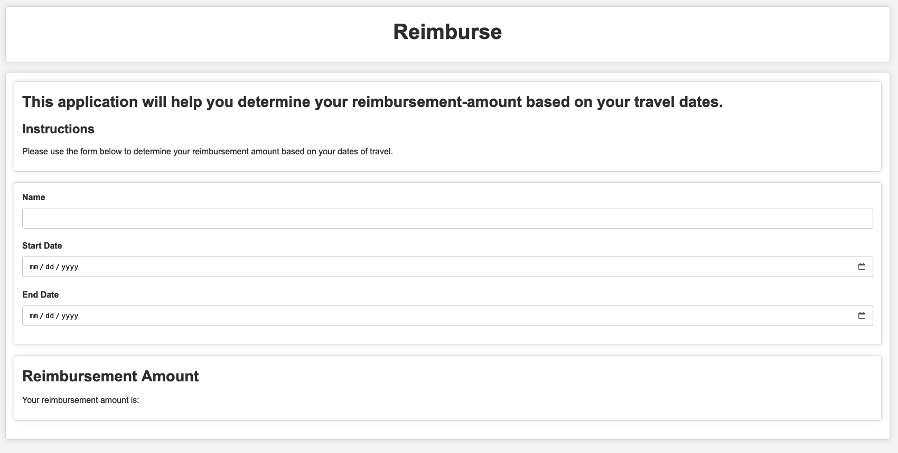

# Reimburse: Expense Reimbursement Application

---



## Overview

Reimburse is a simple, application designed to help users calculate the amount they should be reimbursed for their business trips. It can be used on the command line or as a web application.  The application adheres to specific rules that consider various types of days (travel days, full days, etc.) and cities (low cost, high cost).

## Features

- User-friendly form to input travel data.
- Use the command line with Node.js or a web browser to access the application.
- Dynamic calculation of reimbursement based on user input.
- Clear and straightforward UI for easy navigation and data entry.

## Requirements

- Modern web browser (Chrome, Firefox, Safari, Edge)
- Basic web server to serve the HTML, CSS, and JavaScript files

## Installation

1. Clone the repository to your local machine.

   ```bash
   git clone https://github.com/ElDuke717/effective-octo-disco
   ```

2. Navigate to the directory.

   ```bash
   cd effective-octo-disco
   ```

3. Open the `index.html` file in your web browser.

## Usage

1. Open the web application in your browser.
2. You'll find a form with fields for your Name, Start Date, and End Date of the project.
3. Fill in the required fields and submit.
4. The reimbursement amount will be calculated and displayed below the form.

## Development

The project uses basic HTML, CSS, and JavaScript.

- HTML for markup
- CSS for styling
- JavaScript for logic and DOM manipulation

To contribute to the project:

1. Fork the repository.
2. Clone your fork.
3. Make your changes.
4. Create a pull request.

## License

MIT

---

## Author

Nick Huemmer
